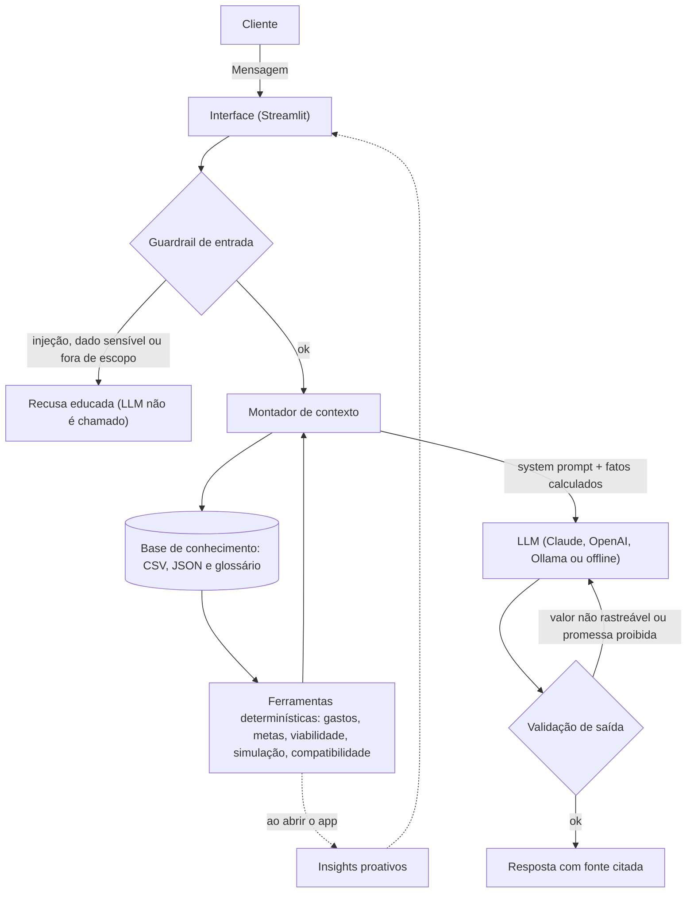

# 🧭 Fin — Copiloto Financeiro Proativo com IA Generativa

> Um agente financeiro que **antecipa** o que importa, **personaliza** pelo perfil do cliente, **cocria** cenários e, principalmente, **não inventa números**: tudo o que ele afirma é calculado em código a partir dos dados e conferido antes de chegar ao cliente.

Projeto do desafio **Agente Financeiro Inteligente com IA Generativa** (Bootcamp DIO).

---

## 💡 O problema

As pessoas têm metas concretas (reserva de emergência, entrada de um imóvel), mas raramente sabem responder: **"do jeito que eu gasto hoje, minhas metas cabem no orçamento e no prazo?"** Apps mostram o passado; chatbots genéricos respondem com confiança, mas podem inventar valores, e em finanças isso é um risco real.

## ✅ O que o Fin faz

| | |
|---|---|
| 🔔 **Proativo** | Ao abrir o app, já mostra insights calculados: progresso da reserva, se as metas cabem no orçamento, categoria que subiu, retomada do último assunto |
| 🎯 **Personalizado** | Usa perfil, transações, histórico e restrição de risco do cliente (a restrição "não aceito risco" prevalece sobre o rótulo do perfil) |
| 🤝 **Cocriativo** | "E se eu guardar R$ 2.000 por mês?" → simula o impacto em cada meta e discute alternativas |
| 🎓 **Educativo** | Explica conceitos (CDI, Selic, liquidez...) com base em um glossário revisado, sem inventar taxas atuais |
| 🛡️ **Confiável** | Números calculados em Python + validação de saída + guardrails de entrada |

## ❌ O que o Fin NÃO faz

- Não é consultoria de investimentos regulada nem substitui um profissional certificado (as sugestões são educativas).
- Não acessa dados bancários reais nem senhas (usa dados fictícios).
- Não conhece cotações nem taxas de hoje (Selic, CDI, preço de ativos): quando não sabe, diz que não sabe.

---

## 🏗️ Arquitetura



**A ideia central:** o LLM não faz contas. As ferramentas em Python calculam; o modelo apenas redige. Depois, um validador confere se todo valor em R$ e todo percentual da resposta existe no contexto; se não existir, o agente reescreve.

**Stack:** Python 3.10+ · Streamlit · pandas · Claude API (Anthropic) / OpenAI / Ollama · pytest

---

## 📁 Estrutura do repositório

```
├── README.md
├── requirements.txt
├── .env.example                      # copie para .env e configure
│
├── data/                             # Base de conhecimento
│   ├── perfil_investidor.json        # Perfil do cliente (original)
│   ├── produtos_financeiros.json     # Catálogo de produtos (original)
│   ├── historico_atendimento.csv     # Histórico de atendimentos (original)
│   ├── transacoes.csv                # Transações (out/2025 original + ago e set adicionados)
│   └── glossario_financeiro.json     # Glossário revisado (novo)
│
├── src/
│   ├── app.py                        # Interface Streamlit
│   ├── agente.py                     # Orquestrador: guardrail → contexto → LLM → validação
│   ├── ferramentas.py                # Cálculos determinísticos (a fonte dos números)
│   ├── contexto.py                   # Monta o contexto enviado ao LLM
│   ├── guardrails.py                 # Filtro de entrada + validação de saída
│   ├── prompts.py                    # System prompt
│   ├── llm.py                        # Provedores: Anthropic, OpenAI, Ollama
│   ├── offline.py                    # Modo sem LLM (demo, testes, plano B)
│   ├── base_conhecimento.py          # Carga e validação dos dados
│   ├── avaliacao.py                  # Executa os cenários de teste do desafio
│   ├── config.py · utils.py
│
├── tests/                            # pytest + cenários de avaliação (cenarios.json)
├── docs/                             # Documentação exigida pelo desafio (01 a 05)
├── assets/                           # Screenshots e diagramas
└── examples/                         # Exemplos de conversa
```

---

## 🚀 Como executar

```bash
# 1. Clone e entre na pasta
git clone <url-do-seu-repositorio>
cd <pasta-do-repositorio>

# 2. Ambiente virtual e dependências
python -m venv .venv
source .venv/bin/activate          # Windows: .venv\Scripts\activate
pip install -r requirements.txt

# 3. Configure o motor de IA (opcional: sem isso roda no modo offline)
cp .env.example .env               # Windows: copy .env.example .env
# edite o .env e preencha ANTHROPIC_API_KEY (ou OPENAI_API_KEY, ou use Ollama)

# 4. Rode o app
streamlit run src/app.py
```

### Motores de IA

| Motor | Como ativar | Observação |
|-------|-------------|------------|
| **Claude (Anthropic)** | `ANTHROPIC_API_KEY` no `.env` | Modelo em `ANTHROPIC_MODEL` (confira os nomes vigentes na [documentação](https://docs.claude.com)) |
| **OpenAI** | `OPENAI_API_KEY` no `.env` | Modelo em `OPENAI_MODEL` |
| **Ollama (local)** | `ollama serve` + `LLM_PROVIDER=ollama` | 100% local, sem enviar dados para APIs |
| **Offline** | Nada (padrão sem chaves) | Regras determinísticas: útil para demo e testes. Não é um LLM |

Você pode trocar o motor pela barra lateral do app, sem reiniciar.

### Testes e avaliação

```bash
pytest -q                                   # testes unitários
python src/avaliacao.py --provider offline  # cenários estruturados (camada determinística)
python src/avaliacao.py --provider anthropic  # cenários com LLM real (gera docs/resultados_anthropic.md)
```

---

## 🛡️ Segurança e anti-alucinação (resumo)

1. **Números vêm de código:** valores, prazos e simulações são calculados em Python.
2. **Validação de saída:** cada valor em R$ e cada % da resposta precisa existir no contexto; senão, reescrita automática e, persistindo, aviso ao cliente.
3. **Guardrails de entrada:** injeção de prompt, dados sensíveis e assuntos fora de escopo são barrados antes do LLM.
4. **Sabe dizer "não sei":** sem taxas ou cotações inventadas.
5. **Perfil manda:** só sugere produtos compatíveis com a restrição de risco.
6. **Transparência:** o painel "Como o Fin chegou nessa resposta" mostra o contexto e a validação.

Detalhes e limitações em [`docs/01-documentacao-agente.md`](docs/01-documentacao-agente.md).

---

## 📚 Entregáveis do desafio

| # | Entregável | Onde |
|---|------------|------|
| 1 | Documentação do agente | [`docs/01-documentacao-agente.md`](docs/01-documentacao-agente.md) |
| 2 | Base de conhecimento | [`docs/02-base-conhecimento.md`](docs/02-base-conhecimento.md) · [`data/`](data/) |
| 3 | Prompts do agente | [`docs/03-prompts.md`](docs/03-prompts.md) |
| 4 | Aplicação funcional | [`src/`](src/) |
| 5 | Avaliação e métricas | [`docs/04-metricas.md`](docs/04-metricas.md) |
| 6 | Pitch | [`docs/05-pitch.md`](docs/05-pitch.md) |

---

## 🗺️ Próximos passos

- Rendimento, inflação e impostos nas simulações
- Recuperação semântica (RAG) sobre uma base maior de produtos e regras
- Alertas proativos por e-mail/WhatsApp
- Observabilidade com LangFuse (tokens, custo, latência)
- Múltiplos clientes e uso como assistente de consultor

## 👤 Autor

**[Seu nome]** · [LinkedIn](https://linkedin.com/in/seu-perfil) · [GitHub](https://github.com/seu-usuario)

*Projeto educacional, desenvolvido no Bootcamp DIO. Os dados são fictícios e o agente não constitui recomendação de investimento.*
