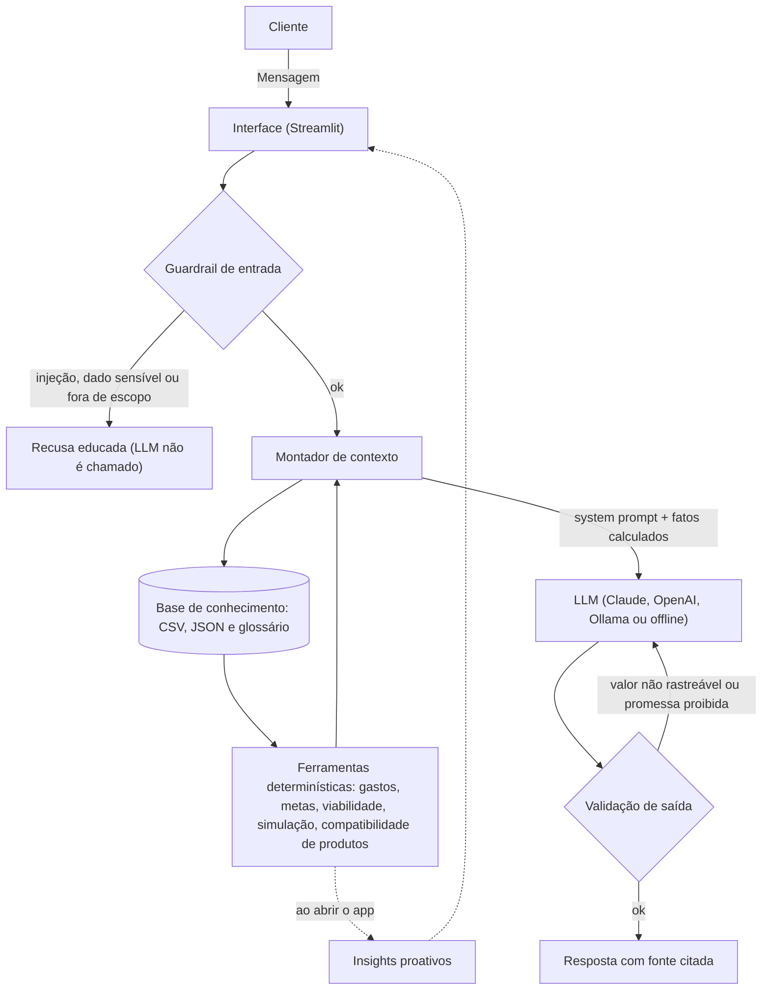

# Documentação do Agente

## Caso de Uso

### Problema
> Qual problema financeiro seu agente resolve?

Quase todo mundo tem metas financeiras concretas (formar uma reserva de emergência, juntar a entrada de um imóvel), mas poucas pessoas conseguem responder com segurança à pergunta que realmente importa: **"do jeito que eu gasto hoje, essas metas cabem no meu orçamento e no meu prazo?"**

Os apps bancários mostram o passado (extrato), e chatbots genéricos costumam responder com números inventados ou com conselhos que ignoram o perfil da pessoa, o que em finanças é um risco real.

### Solução
> Como o agente resolve esse problema de forma proativa?

O **Fin** é um copiloto financeiro que **antecipa** em vez de só reagir:

- **Proativo:** ao abrir o app, o cliente já vê insights calculados a partir dos próprios dados (progresso da reserva, se as metas cabem no orçamento, categoria de gasto que subiu, retomada do último assunto atendido), sem precisar perguntar.
- **Personalizado:** usa perfil, transações, histórico de atendimento e restrição de risco do cliente. Se o cliente se declara "moderado" mas marca que não aceita risco, o Fin trata a restrição como regra e explica isso de forma transparente.
- **Cocriativo:** o cliente propõe cenários ("e se eu guardar R$ 2.000 por mês?") e o Fin simula, mostra o impacto em cada meta e discute alternativas.
- **Confiável (anti-alucinação):** **todos os números são calculados em Python** a partir dos arquivos de dados; o LLM só explica. Uma camada de validação confere se cada valor em R$ e cada percentual da resposta existe nos dados e, se não existir, pede uma reescrita.

### Público-Alvo
> Quem vai usar esse agente?

Pessoas que já têm um objetivo financeiro definido, mas não sabem se conseguem alcançá-lo, e que querem apoio para decidir sem receber "achismo". Pode ser adaptado também para uso interno por consultores, como assistente que prepara a análise do cliente.

---

## Persona e Tom de Voz

### Nome do Agente
**Fin** (Copiloto Financeiro Proativo)

### Personalidade
> Como o agente se comporta? (ex: consultivo, direto, educativo)

- **Consultivo e proativo:** traz observações relevantes sem ser perguntado e sempre propõe um próximo passo.
- **Educativo:** explica conceitos com analogia curta e exemplo usando os dados do próprio cliente.
- **Honesto:** quando não sabe, diz que não sabe; quando algo é apertado (como uma folga de R$ 120,00 por mês), diz isso sem dramatizar.
- **Sem julgamento:** nunca critica os gastos do cliente.

### Tom de Comunicação
> Formal, informal, técnico, acessível?

Acessível e caloroso, tratando o cliente por "você", sem jargão (quando usa um termo técnico, explica). Respostas curtas, com no máximo 3 parágrafos.

### Exemplos de Linguagem
- Saudação: "Olá, João! Sou o Fin. Antes de você perguntar, separei o que merece a sua atenção hoje."
- Confirmação: "Deixa eu olhar seus números para responder isso com precisão."
- Erro/Limitação: "Não tenho essa informação, mas posso te explicar os produtos que conheço, como o Tesouro Selic e o CDB Liquidez Diária."

---

## Arquitetura

### Diagrama

**Fluxo em uma frase:** a mensagem passa por um filtro, o contexto é montado com fatos que o Python já calculou, o LLM redige a resposta e um validador confere se os números têm origem nos dados antes de o cliente ver.

### Componentes

| Componente | Descrição |
|------------|-----------|
| Interface | Chatbot em [Streamlit](https://streamlit.io/) com painel de insights proativos, barra lateral com perfil e metas, e um painel "Como o Fin chegou nessa resposta" (transparência) |
| LLM | Configurável por `.env`: **Claude (Anthropic)**, OpenAI ou **Ollama** (local). Há também o modo **offline** (regras determinísticas) para demonstração sem chave e para os testes |
| Base de Conhecimento | JSON/CSV mockados da pasta `data/` + glossário financeiro (`glossario_financeiro.json`) |
| Ferramentas (`ferramentas.py`) | Cálculo determinístico de resumo mensal, gastos por categoria, progresso e viabilidade das metas, simulação de aportes, compatibilidade de produtos e insights |
| Validação (`guardrails.py`) | Filtro de entrada (injeção de prompt, dados sensíveis, fora de escopo) e checagem de saída (rastreabilidade de valores e promessas proibidas), com uma reescrita automática |

---

## Segurança e Anti-Alucinação

### Estratégias Adotadas

- [x] **Números vêm de código, não do modelo:** valores, prazos e simulações são calculados em Python; o LLM apenas os explica
- [x] **Validação de saída:** todo valor em R$ e todo percentual da resposta precisa existir no contexto; se não existir, o agente reescreve uma vez e, persistindo, avisa o cliente
- [x] **Guardrail de entrada determinístico:** injeção de prompt, pedidos de senha/dados de terceiros e assuntos fora de finanças são barrados antes de chamar o LLM (não dependem de o modelo "obedecer")
- [x] **Quando não sabe, admite e redireciona:** cotações e valores atuais de Selic/CDI não constam na base, então o agente diz que não tem a informação
- [x] **Só sugere produtos compatíveis com o perfil:** a restrição "não aceita risco" prevalece sobre o rótulo do perfil
- [x] **Sem promessas de retorno:** frases como "lucro garantido" são barradas na validação
- [x] **Fontes citadas e premissas explícitas:** respostas indicam o arquivo de origem; premissas (ex.: patrimônio fora da reserva destinado ao apartamento) são declaradas
- [x] **Transparência:** o painel "Como o Fin chegou nessa resposta" mostra o contexto enviado ao modelo e o resultado da validação
- [x] **Testes automatizados:** 59 testes cobrem cálculos, guardrails, validação, lógica de reescrita e cenários de avaliação

### Limitações Declaradas
> O que o agente NÃO faz?

- **Não é consultoria de investimentos regulada** e não substitui um profissional certificado; as sugestões são educativas.
- **Não acessa dados bancários reais nem senhas:** trabalha com dados fictícios de um único cliente.
- **Não conhece cotações nem taxas de hoje** (Selic, CDI, preço de ativos); só usa o que está no catálogo e no glossário.
- **Simulações simples:** aportes fixos, sem rendimentos, inflação ou impostos, o que torna os resultados conservadores.
- **A validação é uma heurística:** confere valores e percentuais, mas não consegue provar que uma afirmação qualitativa esteja correta.
- **Usa uma data de referência fixa** (nov/2025) para que prazos e metas façam sentido com os dados de exemplo.
